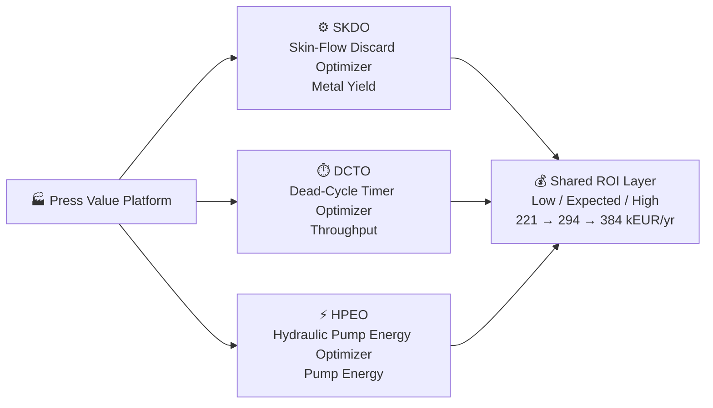
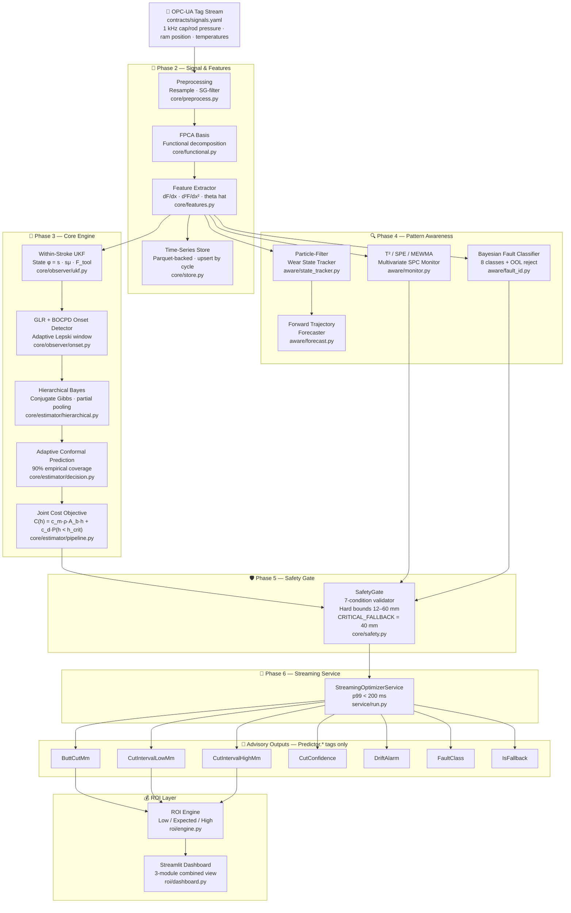
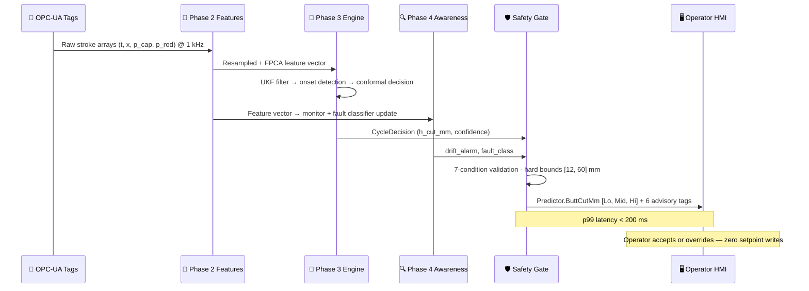
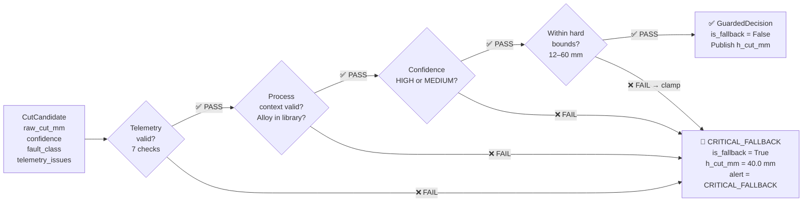

<div align="center">


<br/>

[](https://git.io/typing-svg)

<br/>


<br/>

> **Third module of the [Press Value Platform](#-press-value-platform)**
> Part of a three-module advisory system targeting **221–384 kEUR/yr** combined savings per press.

</div>

---

<div align="center">

## ⚡ The Problem — Every Billet, Every Cycle

</div>

Every aluminium extrusion press discards 40–80 mm of metal from every billet — the **"butt"**, a tail-end slug contaminated by oxidised skin-flow. Static cut rules are set conservatively at **40 mm** to protect quality across all alloys and tool conditions.

The cost is silent and continuous: **recoverable aluminium lost on every single cycle.**

```
╔══════════════════════════════════════════════════════════════════════╗
║  BILLET            ████████████████████████████████████░░░░░░░░     ║
║                    ◄─────── extruded profile ──────────►◄─discard─► ║
║                                                         40 mm static ║
║  SKDO recommends → ─────────────────────────────────────►◄─ ~29.5mm ║
║                                               ~10.5 mm recovered ↑   ║
╚══════════════════════════════════════════════════════════════════════╝
```

**SKDO replaces the static rule with a per-billet adaptive recommendation** — reading live 1 kHz force-curve signals, detecting skin-flow onset in real time, and publishing a tighter cut to the operator HMI before the ram stops.

---

<div align="center">

## 🏭 Press Value Platform Context

</div>

SKDO is **Module 1** of the Press Value Platform — a three-module advisory system addressing all four value levers on a modern aluminium extrusion press from a single OPC-UA tag stream.



| Module | Primary Lever | Low | Expected | High |
|---|---|:---:|:---:|:---:|
| **SKDO** — this repo | Metal yield via tighter discard cut | 107 | **121** | 143 kEUR/yr |
| **DCTO** | Throughput via dead-cycle compression | 98 | **147** | 204 kEUR/yr |
| **HPEO** | Energy via pressure-reduction windows | 16 | **26** | 36 kEUR/yr |
| 🏆 **Joint Total** | All three modules | **221** | **294** | **384 kEUR/yr** |

_Economics: aluminium spread 0.50 EUR/kg · tariff 64.3 EUR/MWh · press rate 950 EUR/hr · 309,600 cycles/yr._

---

<div align="center">

## 🏗️ Full System Architecture

</div>



---

<div align="center">

## ⏱️ Per-Billet Data Flow

</div>



---

<div align="center">

## 🛡️ Safety Fallback Logic

</div>



**7/7 stress scenarios correctly trigger CRITICAL_FALLBACK** — verified in `eval/stress.py`.

---

<div align="center">

## 🔬 Core Algorithms

</div>

### ① Within-Stroke Unscented Kalman Filter — `core/observer/ukf.py`

The UKF estimates force-model parameters **within a single extrusion stroke** at 1 kHz. The key design decision: filter over **φ = [s, s·μ, F\_tool]** rather than θ directly.

> **Why φ-space?** The force model is bilinear in θ. The `s·μ` product is far more tightly pinned by the data than s alone, so the θ-posterior is a curved ridge a Gaussian cannot represent. A direct-θ UKF drifted ~20% from the exact posterior on the same data. In φ-space the measurement is **linear** — the unscented update is exact. θ and its covariance are recovered by an unscented transform after each update.

| Detail | Value |
|---|---|
| State vector | φ = [s, s·μ, F\_tool] |
| Filter start | 12% of stroke (avoids dummy-block breakthrough bump) |
| Ram speed estimate | LS slope over trailing 1 s window (not 2-point finite diff — eliminates ~1% bias) |
| Process noise | Driven to ~0 by MLE on healthy strokes (θ is constant within a stroke) |
| Identifiability | σ\_scale and F\_tool weakly identifiable individually; μ and force prediction solid |

---

### ② GLR + BOCPD Onset Detector — `core/observer/onset.py`

Dual-test detector for the skin-flow upturn in the force curve:

| Test | Signal | Detects |
|---|---|---|
| **GLR** (Generalised Likelihood Ratio) | dF/dx | Mean-shift in force gradient when upturn begins |
| **BOCPD** (Bayesian Online Change-Point Detection) | d²F/dx² | Curvature change confirming the exponential upturn |

Derivative estimation uses **Savitzky-Golay with Lepski-adaptive window selection** (κ = 3.5, window range 2.1–40 mm). The window is chosen per-position from local noise level — a single global window cannot serve both the near-linear mid-stroke and the sharp end-of-stroke bend.

```
Accuracy vs noise-free truth:
  dF/dx  → ~2% mid-stroke · <1% in the gated tail
  d²F/dx² → ~5% in the tail
```

Onset is defined as the thickness where F\_up reaches `upturn.amplitude_at_onset_N = 0.25 MN` — a physical criterion, not "first departure from noise".

---

### ③ Hierarchical Bayesian Estimator + Conformal Prediction — `core/estimator/`

```
Per-billet posterior → P(h_crit | stroke data, die, alloy)
       │
       ▼
Adaptive conformal prediction interval
  Target: 90% empirical coverage of true h_crit
  Method: requires 1-in-20 billets audited (macro-etch or sectioning)
           result arrives 5 cycles late
       │
       ▼
Joint cost optimisation
  C(h) = c_m · ρ · A_b · h  +  c_d · L_d · P(h < h_crit | data)
  where c_m = billet_price_per_kg − remelt_credit_per_kg
       │
       ▼
h* = Predictor.ButtCutMm
```

The hierarchical model uses **partial pooling by die and alloy** via a hand-written **conjugate Gibbs sampler** — no PyMC/NumPyro dependency; runs on Python 3.14+.

---

### ④ Pattern-Awareness Layer — `skinflow_discard_optimizer/aware/`

| Component | Algorithm | Output |
|---|---|---|
| `state_tracker.py` | **Particle filter** | Online wear / tool-state estimation across cycles |
| `monitor.py` | **Hotelling T² + SPE + MEWMA** | `Predictor.DriftAlarm` — raised before quality limit breach |
| `fault_id.py` | **Bayesian multi-class classifier** | `Predictor.FaultClass` — 8 named classes + OOL reject |
| `forecast.py` | **Forward trajectory model** | Projected state evolution for proactive maintenance scheduling |

---

<div align="center">

## 📊 Evaluation Results (Phase 5 — Simulation)

</div>

> [!NOTE]
> All numbers are from a physics-validated digital twin. **No real press data has been used.** See [Pilot Programme](#-pilot-programme-required) for what must be verified before production deployment.

Evaluated on a **rolling-origin backtest** across **13 scenarios** (11 development + 2 fully held-out) spanning **12,660 billet cycles**. All figures reported with 95% CI — point estimates alone are never cited.

### Headline KPIs

| KPI | Point Estimate | 95% CI | Target | Status |
|---|:---:|:---:|:---:|:---:|
| Mean discard thickness | **29.5 mm** | [28.6, 30.2] | < 40 mm static | ✅ PASS |
| Metal recovery vs. static | **1.29% billet mass** | [1.20%, 1.40%] | > 0 | ✅ PASS |
| Net saving per billet | **0.390 EUR** | [0.346, 0.463] | > 0 | ✅ PASS |
| Defect rate | **0.56 / 1,000 billets** | [0.44, 0.68] | ≤ static baseline | ⚠️ CAUTION |
| False-alarm rate | **4.9 / 1,000 cycles** | [2.9, 7.4] | ≤ 5.0 / 1,000 | ✅ PASS |
| Warning lead time (median) | **300 cycles (~7 h)** | [−29, 1,546] | median > 0 | ✅ PASS |
| Conformal coverage | **91.4%** | [90.9%, 92.1%] | 90% ± 2% | ✅ PASS |
| Cut-decision latency (p99) | **15.8 ms** | — | < 200 ms | ✅ PASS |

> [!WARNING]
> **Defect rate ⚠️ CAUTION.** SKDO introduces a small positive defect risk by cutting closer to the skin-flow boundary. The absolute rate (0.56/1,000) is well below typical industry total-reject rates of 5–15/1,000. The CAUTION flag is deliberate transparency, not a safety failure.

### Per-Scenario Breakdown

| Scenario | Held-out | Cycles | Mean cut (mm) | Recovery (%) | Defect/1k | Saving (EUR/billet) |
|---|:---:|:---:|:---:|:---:|:---:|:---:|
| healthy_baseline | — | 1,260 | 28.4 | 1.42 | 0.59 | 0.442 |
| alloy_change | — | 540 | 28.6 | 1.40 | 0.44 | 0.486 |
| cold_start_days | — | 540 | 28.6 | 1.41 | 0.51 | 0.462 |
| die_wear | — | 540 | 31.1 | 1.09 | 0.50 | 0.321 |
| encoder_offset | — | 540 | 29.2 | 1.33 | 0.11 | 0.588 |
| flash_spike | — | 540 | 28.5 | 1.41 | 0.53 | 0.457 |
| liner_scale | — | 540 | 32.6 | 0.90 | 0.55 | 0.211 |
| lubricant_loss | — | 540 | 28.6 | 1.40 | 0.82 | 0.340 |
| sensor_gain_drift | — | 540 | 28.5 | 1.41 | 0.37 | 0.521 |
| supply_pressure_sag | — | 540 | 28.2 | 1.45 | 0.41 | 0.522 |
| temperature_drift | — | 540 | 26.9 | 1.60 | 0.58 | 0.531 |
| **combined_wear_and_scale** | **✅ held-out** | 3,200 | 30.8 | 1.13 | 0.47 | 0.347 |
| **die_change** | **✅ held-out** | 2,800 | 29.2 | 1.32 | 0.80 | 0.310 |

### Drift Detection Lead Times

| Scenario | Lead Time | Primary Channel | Status |
|---|:---:|:---:|:---:|
| temperature_drift | **+4,660 cycles** | MEWMA | ✅ |
| flash_spike | **+1,546 cycles** | MEWMA | ✅ |
| combined_wear_and_scale | **+1,406 cycles** | MEWMA | ✅ |
| encoder_offset | **+469 cycles** | MEWMA | ✅ |
| supply_pressure_sag | **+300 cycles** | MEWMA | ✅ |
| lubricant_loss | **+66 cycles** | T² | ✅ |
| die_wear | **+222 cycles** | MEWMA | ✅ |
| sensor_gain_drift | −29 cycles | T² | ⚠️ late |
| liner_scale | −202 cycles | T² | ⚠️ late |

> **⚠️ Late detection** on `liner_scale` and `sensor_gain_drift` is caused by abrupt step-changes rather than gradual drift. MEWMA's exponential weighting λ may need per-site tuning for rapid-onset faults.

---

<div align="center">

## 📁 Repository Layout

</div>

```
skinflow_discard_optimizer/          # Main Python package (v0.1.0)
│
├── sim/                             # Physics-validated digital twin
│   ├── force_model.py               #   Ram force: friction + skin-flow upturn
│   ├── defect_model.py              #   Onset probability (sigmoid in h − h_crit)
│   ├── cycle.py                     #   Single-stroke simulator @ 1 kHz
│   ├── faults.py                    #   Fault / drift injection engine
│   ├── build_dataset.py             #   Seed-based 200k-cycle dataset builder
│   └── scenarios/                   #   13 YAML scenario definitions
│       ├── healthy_baseline.yaml
│       ├── die_wear.yaml
│       ├── liner_scale.yaml
│       ├── combined_wear_and_scale.yaml  ← held-out
│       ├── die_change.yaml              ← held-out
│       └── ... (8 more)
│
├── core/                            # Core estimation engine
│   ├── preprocess.py                #   Resample · filter · windowing
│   ├── build_features.py            #   Full feature pipeline
│   ├── features.py                  #   Functional feature definitions
│   ├── functional.py                #   FPCA fitting
│   ├── store.py                     #   Parquet-backed time-series store
│   ├── assembler.py                 #   Multi-phase cycle assembler
│   ├── joint.py                     #   Joint SKDO + DCTO + HPEO objective
│   ├── safety.py                    #   SafetyGate: 7 conditions + hard bounds
│   ├── observer/
│   │   ├── ukf.py                   #   UKF over φ = [s, sμ, F_tool]
│   │   ├── onset.py                 #   GLR + BOCPD dual-test detector
│   │   ├── tune_ukf.py              #   MLE hyperparameter tuner
│   │   └── eval_onset.py            #   Onset evaluation harness
│   └── estimator/
│       ├── hierarchical.py          #   Conjugate Gibbs sampler (partial pooling)
│       ├── decision.py              #   Adaptive conformal prediction intervals
│       ├── fit_decision.py          #   Offline calibration
│       └── pipeline.py             #   Joint cost → h* → Predictor.ButtCutMm
│
├── aware/                           # Pattern-awareness layer
│   ├── state_tracker.py             #   Particle-filter wear tracker
│   ├── monitor.py                   #   T² / SPE / MEWMA SPC
│   ├── forecast.py                  #   Forward trajectory forecaster
│   └── fault_id.py                  #   Bayesian fault classifier (8 + OOL)
│
├── eval/                            # Offline evaluation
│   ├── backtest.py                  #   Rolling-origin backtest (13 scenarios)
│   ├── ablation.py                  #   Component ablation study
│   └── stress.py                    #   Safety-gate stress tests (7 scenarios)
│
├── service/                         # Streaming service
│   ├── run.py                       #   OPC-UA subscriber → decision loop
│   └── replay.py                    #   Parquet-replay mode (no live press)
│
├── roi/                             # ROI aggregation
│   ├── engine.py                    #   Low / expected / high annual ROI
│   └── dashboard.py                 #   3-module combined Streamlit dashboard
│
├── accel/
│   └── gpu_engine.py                #   Optional GPU-accelerated inference
│
├── config.py                        # Pydantic settings root
└── paths.py                         # Canonical path constants

config/                              # Process & economic YAML (all values versioned)
├── press.yaml                       # Bore, ram area, stroke, stall limit, timings
├── alloys.yaml                      # Flow-stress σ₀, n, taper (AA6063, AA6082)
├── decision.yaml                    # Conformal target, audit rate, audit delay
├── defect.yaml                      # Onset threshold, Weibull defect parameters
├── economics.yaml                   # Metal price, remelt credit, tariff, press rate
├── coupling.yaml                    # DCTO shear-stroke timing (sourced from DCTO)
├── dies.yaml                        # Die geometry
└── faults.yaml                      # Fault injection parameters

contracts/
└── signals.yaml                     # Full OPC-UA signal contract (all 3 modules)

docs/
├── assumptions.md                   # All 28 placeholders and open questions
├── integration_audit.md             # DCTO + HPEO read-only integration audit
├── kpis.md                          # KPI definitions and measurement methods
└── pitch/                           # Technical pitch documents
    ├── 01_technical_summary.md
    ├── 02_architecture_diagram.md
    ├── 03_results.md
    ├── 04_assumptions_and_limits.md
    └── 05_demo_script.md

tests/                               # 23 pytest modules
```

---

<div align="center">

## 📡 Signal Contract

</div>

All inter-module signals are defined in [`contracts/signals.yaml`](contracts/signals.yaml). Key schema per signal:

```yaml
ram_cap_pressure:
  tag:      "ns=2;s=Press01.Ram.CapPressure"
  unit:     bar
  rate_hz:  1000         # 1 kHz — primary force-model input
  type:     float
  range:    [0, 380]     # PLACEHOLDER — verify against real press
  owner:    skinflow
  kind:     measured
```

**Signals SKDO needs that neither DCTO nor HPEO currently provide** (defined fresh in `contracts/signals.yaml` with `owner: skinflow`):

- Ram cap pressure and rod pressure — separate, at 1 kHz
- Container liner temperatures 1–4
- Billet temperature, oil temperature
- Supply-pressure minimum during stroke
- Butt shear position

**SKDO advisory output tags** (read-only, no setpoint writes):

| Tag | Description |
|---|---|
| `Predictor.ButtCutMm` | Recommended discard cut (mm) |
| `Predictor.CutIntervalLowMm` / `HighMm` | 90% conformal interval bounds |
| `Predictor.OnsetDepthMm` | Detected skin-flow onset depth |
| `Predictor.DriftAlarm` | Bool — T²/MEWMA drift alarm active |
| `Predictor.FaultClass` | String — identified fault or `healthy` / `unknown` |
| `Predictor.CutConfidence` | Enum — `HIGH` · `MEDIUM` · `LOW` · `CRITICAL_FALLBACK` |
| `Predictor.IsFallback` | Bool — safety gate triggered |

---

<div align="center">

## ⚙️ Configuration

</div>

All constants live in versioned YAML under `config/`. Every value marked **`PLACEHOLDER`** must be replaced with sourced plant data before production use.

| File | Key contents | Status |
|---|---|:---:|
| `press.yaml` | Container bore, billet geometry, ram area, stall limit, phase timings, onset direction | PLACEHOLDER |
| `alloys.yaml` | Flow-stress σ₀ and n for AA6063, AA6082; taper and deformation-heating | PLACEHOLDER |
| `decision.yaml` | Conformal target coverage, audit rate, audit delay, cost weights | PLACEHOLDER |
| `defect.yaml` | Onset amplitude threshold, Weibull defect model, hard bounds | PLACEHOLDER |
| `economics.yaml` | `billet_price_per_kg`, `remelt_credit_per_kg`, `defect_loss_per_event`, tariff | ⚠️ ALL PLACEHOLDER |
| `coupling.yaml` | DCTO shear-stroke timing (source: `DCTO/simulator/press_config.py`) | Sourced |

---

<div align="center">

## ⚠️ Integration Hazards

</div>

Full audit in [`docs/integration_audit.md`](docs/integration_audit.md). Key conflicts between DCTO and HPEO that SKDO resolves:

| # | Conflict | Resolution |
|---|---|---|
| C1 | Phase names differ (DCTO: 8 phases, HPEO: 7) | Canonical enum in `contracts/signals.yaml` with alias maps from both |
| C5 | DCTO publishes ram position under node name `ContainerPosition` | Contract separates `ram_position` and `container_position` |
| C6 | DCTO and HPEO both bind `opc.tcp://127.0.0.1:4840` | SKDO subscribes only; mock mode uses port **4842** |
| C7 | Both have top-level `simulator/` and `opcua/` packages | All SKDO code lives under `skinflow_discard_optimizer/`; sibling repos never added to `sys.path` |
| C9 | DCTO pins `numpy<2.0`; this environment uses numpy 2.x | SKDO targets numpy 2.x; DCTO code never imported at runtime |
| C11 | HPEO writes pump staging setpoints | SKDO is advisory only — writes only `Predictor.*` |

---

<div align="center">

## 🧪 Pilot Programme Required

</div>

> [!IMPORTANT]
> All results are from simulation. These six items must be verified on real data before any commercial deployment.

| # | What | Why | Config |
|---|---|---|---|
| 1 | **Force-curve direction** | Twin uses upturn; real presses may show a pressure-drop at onset | `press.yaml → onset_direction` |
| 2 | **Alloy calibration** | Only AA6063/AA6082 are calibrated; 200–500 billets/alloy needed | `core/estimator/hierarchical.py` |
| 3 | **Defect labelling** | `h_crit` is simulated; 3–6 months of matched quality-gate records needed | `sim/defect_model.py` |
| 4 | **OPC-UA tag mapping** | Tag names must be mapped against `contracts/signals.yaml` per press controller | `contracts/signals.yaml` |
| 5 | **Latency verification** | p99 < 200 ms confirmed under sim load; real OPC-UA jitter must be measured | `service/run.py → ServiceHealth` |
| 6 | **🔑 Key hypothesis** | Onset must lead h\_crit by > 0 mm on real force curves — measure this **first** | `config/press.yaml → onset_direction` |

> [!CAUTION]
> **The critical hypothesis (item 6):** SKDO is only actionable if the end-of-stroke force change starts *before* the cost-optimal cut point. The twin places onset 10 ± 0.8 mm above h\_crit. If a real press shows the change only a few mm before or after h\_crit, onset detection cannot drive the cut and value must come from cross-cycle prediction alone. **Measure this gap on real force curves before anything else.**

---

<div align="center">

## 🚀 Installation & Running

</div>

```bash
# 1. Create and activate a virtual environment
python -m venv .venv
.venv\Scripts\activate          # Windows
# source .venv/bin/activate     # macOS / Linux

# 2. Install (editable)
pip install -e .

# 3. Dev dependencies (pytest)
pip install -e ".[dev]"
```

**Generate the simulation dataset:**
```bash
python -m skinflow_discard_optimizer.sim.build_dataset
```

**Run the rolling-origin backtest (Phase 5):**
```bash
python -m skinflow_discard_optimizer.eval.backtest
```

**Run the safety-gate stress tests:**
```bash
python -m skinflow_discard_optimizer.eval.stress
```

**Run the streaming service — replay mode (no live press needed):**
```bash
python -m skinflow_discard_optimizer.service.replay
```

**Run the streaming service — live OPC-UA mode:**
```bash
python -m skinflow_discard_optimizer.service.run
```

---

<div align="center">

## 🧪 Testing

</div>

```bash
pytest                    # all 23 test modules
pytest -m "not slow"      # skip long-running tests
pytest tests/test_ukf.py -v
```

| Module | Covers |
|---|---|
| `test_ukf.py` | UKF correctness, φ-space state recovery, sigma points |
| `test_onset.py` | GLR + BOCPD detection, Lepski window selection |
| `test_decision.py` | Conformal calibration, interval coverage |
| `test_joint.py` | Joint cost objective, h* optimisation |
| `test_force_model.py` | Ram force physics, friction, upturn |
| `test_defect_model.py` | Onset probability sigmoid |
| `test_backtest.py` | Rolling-origin evaluation protocol |
| `test_ablation.py` | Component ablation study |
| `test_safety.py` | SafetyGate 7-condition validation, hard bounds |
| `test_stress.py` | CRITICAL_FALLBACK under all 7 stress scenarios |
| `test_monitor.py` | T² / SPE / MEWMA alarm thresholds |
| `test_fault_id.py` | Bayesian classifier, OOL rejection |
| `test_contracts.py` | Signal schema validation |
| `test_service.py` | Streaming service integration |
| `test_roi.py` | Low / expected / high ROI computation |
| `test_preprocess.py` | Resample, SG-filter, Lepski window |
| `test_features.py` | Feature extraction correctness |
| `test_config.py` | Pydantic settings validation |
| `test_state_tracker.py` | Particle filter convergence |
| `test_forecast.py` | Trajectory projection |
| `test_functional.py` | FPCA basis fitting |
| `test_faults_and_scenarios.py` | All 13 scenario generators |
| `test_gpu_engine.py` | GPU-accelerated inference path |

---

<div align="center">

## 📋 Key Assumptions

</div>

All 28 assumptions with sources in [`docs/assumptions.md`](docs/assumptions.md). The five most critical:

| ID | Assumption | Status |
|---|---|:---:|
| A-02 | Signal tag names from `contracts/signals.yaml`, not from any real tag list | ⚠️ Must verify |
| A-03 | Signal `range` fields are sanity limits, not process limits | ⚠️ PLACEHOLDER |
| A-06 | All values in `config/economics.yaml` are PLACEHOLDER | ⚠️ Must replace |
| A-12 | Force upturn leads skin flow by ~10 mm — key hypothesis for pilot | 🔑 Must measure first |
| A-26 | Conformal calibration assumes 1-in-20 billets audited, 5 cycles late | ⚠️ Agree with plant |

---

<div align="center">

## 🚫 Limitations

</div>

- **Does not control any actuator.** Publishes `Predictor.*` advisory tags only — never writes shear, valve, or pump setpoints.
- **Does not guarantee zero defects.** Reduces expected discard while keeping defect risk low; residual rate ~0.56/1,000 exists vs ~0/1,000 for the static rule.
- **Does not operate on unseen alloys without calibration.** SafetyGate issues CRITICAL_FALLBACK for alloy IDs not in the calibrated library.
- **Does not perform online learning.** All model parameters are frozen after calibration; periodic re-calibration (6–12 months or after major tooling changes) is needed.
- **Does not replace operator judgement.** Every `Predictor.*` signal is a recommendation the operator accepts or overrides.
- **Conformal guarantee degrades without audits.** Without periodic discard sectioning, the prediction interval is only as good as its offline calibration.

---

<div align="center">


**Skin-Flow Discard Optimizer** · Part of the [Press Value Platform](../)<br/>
SKDO · [DCTO](../DCTO) · [HPEO](../HPEO)

</div>
