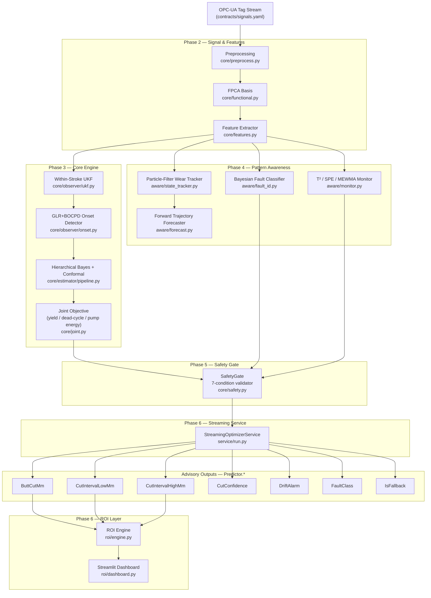
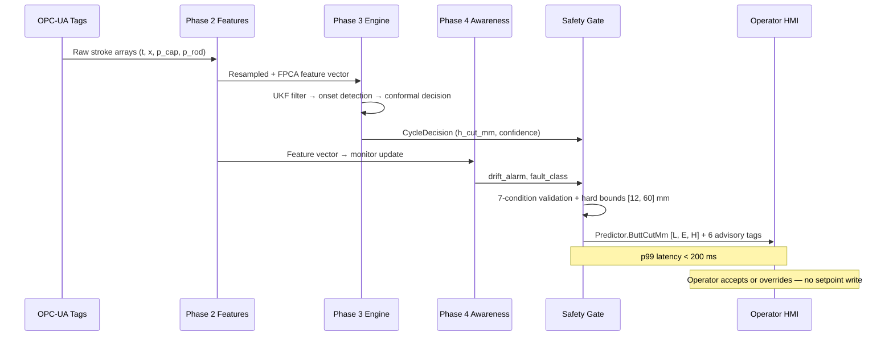
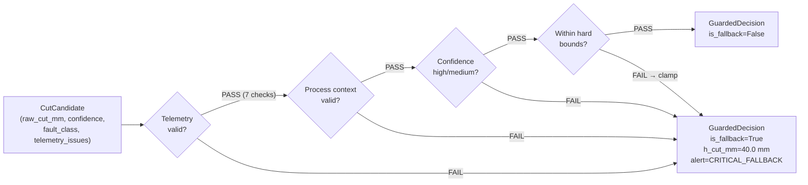

# Press Value Platform — Architecture Diagram

> **One page.** Every block below maps 1-to-1 to a source file in the repository.

---

## System Overview

---

## Data Flow Per Billet Cycle

---

## Safety Fallback Logic

---

## Module Mapping

| Module | Phase | Primary file | Advisory tag |
|---|---|---|---|
| Skin-Flow Discard Optimizer (SKDO) | 3 | `core/estimator/pipeline.py` | `Predictor.ButtCutMm` |
| Dead-Cycle Timer Optimizer (DCTO) | 3 | `core/joint.py` | (throughput advisory) |
| Hydraulic Pump Energy Optimizer (HPEO) | 3 | `core/joint.py` | (pressure-schedule advisory) |
| Wear-State Tracker | 4 | `aware/state_tracker.py` | `Predictor.DriftAlarm` |
| Fault Classifier | 4 | `aware/fault_id.py` | `Predictor.FaultClass` |
| Safety Gate | 5 | `core/safety.py` | `Predictor.IsFallback` |
| ROI Engine | 6 | `roi/engine.py` | (dashboard only) |
